# 🎓 School CRUD API

<div align="center">


</div>

> API RESTful para gerenciamento de **Alunos** e **Professores** desenvolvida com **TypeScript**, **Express 5** e **MySQL2**. O projeto segue uma arquitetura em camadas (Controller → Service → Repository → Model) e aplica conceitos de Orientação a Objetos como herança, abstração e o padrão de projeto **Factory Method**.

---

## 📋 Sumário

- [Visão Geral](#-visão-geral)
- [Estrutura do Projeto](#-estrutura-do-projeto)
- [Arquitetura](#️-arquitetura)
- [Modelo de Domínio](#-modelo-de-domínio-oop)
- [Banco de Dados](#️-banco-de-dados)
- [Ciclo de Vida de uma Requisição](#-ciclo-de-vida-de-uma-requisição)
- [Endpoints da API](#-endpoints-da-api)
- [Formato das Respostas](#-formato-das-respostas)
- [Validações de Negócio](#-validações-de-negócio)
- [Tecnologias](#-tecnologias)
- [Qualidade de Código](#-qualidade-de-código)
- [Ferramentas de Teste](#-ferramentas-de-teste)
- [Como Executar](#-como-executar)
- [Padrões de Projeto](#-padrões-de-projeto)

---

## 🔎 Visão Geral

O **School CRUD API** é um sistema backend voltado para o gerenciamento de entidades acadêmicas. A API permite operações completas de **CRUD** (Create, Read, Update, Delete) para alunos e professores, com validações de negócio aplicadas diretamente nas classes de domínio.

O projeto foi construído com foco em:

- **Separação de responsabilidades** entre as camadas
- **Reutilização de código** via herança e abstração
- **Segurança contra SQL Injection** com queries parametrizadas no `mysql2`
- **Validação centralizada** nas entidades de domínio
- **Código limpo e aprovado** pelo SonarQube

---

## 📁 Estrutura do Projeto

```
├── 📁 docs
│   └── 📄 banco.sql                    # Schema do banco de dados MySQL
├── 📁 src
│   ├── 📁 config
│   │   ├── 📁 enum
│   │   │   └── 📄 EnvKey.ts            # Enum com as chaves de variáveis de ambiente
│   │   └── 📄 EnvVar.ts                # Carregamento e acesso às variáveis de ambiente
│   ├── 📁 controllers
│   │   ├── 📄 aluno.controller.ts      # Handlers HTTP para rotas de alunos
│   │   └── 📄 professor.controller.ts  # Handlers HTTP para rotas de professores
│   ├── 📁 database
│   │   └── 📄 db.connection.ts         # Pool de conexão MySQL2
│   ├── 📁 middleware                   # Middlewares Express (ex: validação, erros)
│   ├── 📁 models
│   │   ├── 📄 aluno.model.ts           # Classe Aluno, interface IAlunoRow
│   │   └── 📄 professor.model.ts       # Classe Professor, interface IProfessorRow
│   ├── 📁 repository
│   │   ├── 📄 aluno.repository.ts      # Queries SQL para a tabela alunos
│   │   └── 📄 professor.repository.ts  # Queries SQL para a tabela professores
│   ├── 📁 routes
│   │   ├── 📄 aluno.routes.ts          # Definição das rotas de alunos
│   │   └── 📄 routes.ts                # Roteador raiz (agrega todos os routers)
│   ├── 📁 services
│   │   ├── 📄 aluno.service.ts         # Regras de negócio dos alunos
│   │   └── 📄 professor.service.ts     # Regras de negócio dos professores
│   └── 📄 server.ts                    # Ponto de entrada da aplicação Express
├── ⚙️ .gitignore
├── ⚙️ package.json
└── ⚙️ tsconfig.json
```

---

## 🏗️ Arquitetura

O projeto adota uma **arquitetura em 4 camadas** com fluxo de dependência unidirecional. Cada camada possui uma responsabilidade única e bem definida.

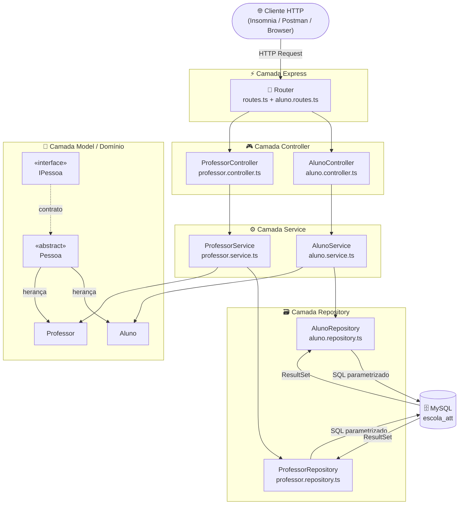

### Responsabilidades por Camada

| Camada         | Arquivo(s)        | Responsabilidade                                                    |
| -------------- | ----------------- | ------------------------------------------------------------------- |
| **Controller** | `*.controller.ts` | Receber requisições HTTP, validar entrada, retornar respostas       |
| **Service**    | `*.service.ts`    | Orquestrar regras de negócio, instanciar modelos via Factory Method |
| **Repository** | `*.repository.ts` | Executar queries SQL com parâmetros seguros contra SQL Injection    |
| **Model**      | `*.model.ts`      | Representar entidades com validações internas e encapsulamento      |

---

## 🧬 Modelo de Domínio (OOP)

A camada de domínio utiliza **herança**, **abstração** e **encapsulamento** para modelar as entidades. O padrão **Factory Method** é aplicado como métodos estáticos que controlam a criação de instâncias.

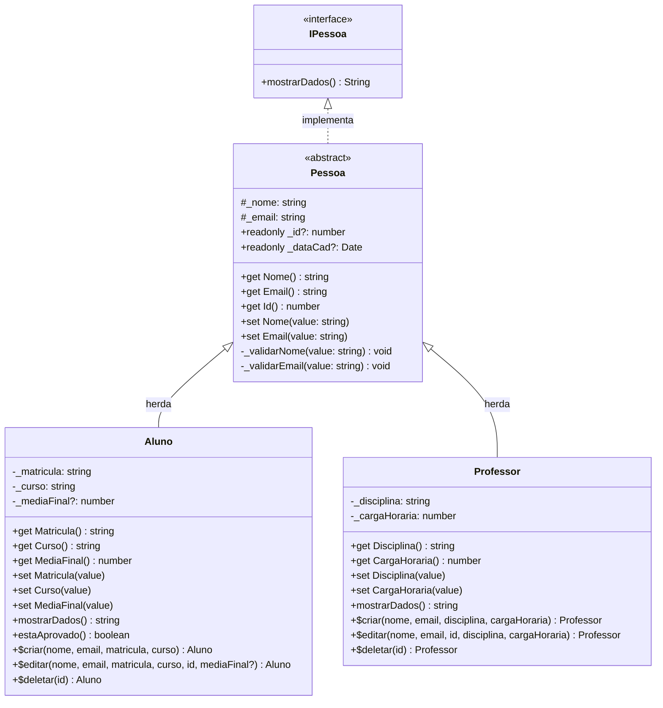

---

## 🗄️ Banco de Dados

O banco utiliza **MySQL 8** com o schema `escola_att`. As tabelas possuem registro automático de data de cadastro via `TIMESTAMP DEFAULT CURRENT_TIMESTAMP` e restrições de unicidade nos campos de email e matrícula.

### Schema

```sql
CREATE TABLE IF NOT EXISTS alunos (
    id          INT AUTO_INCREMENT PRIMARY KEY,
    nome        VARCHAR(45)     NOT NULL,
    email       VARCHAR(100)    UNIQUE NOT NULL,
    data_cad    TIMESTAMP       DEFAULT CURRENT_TIMESTAMP,
    matricula   VARCHAR(7)      UNIQUE NOT NULL,
    curso       VARCHAR(50)     NOT NULL,
    mediaFinal  DECIMAL(2, 2)
);

CREATE TABLE IF NOT EXISTS professores (
    id           INT AUTO_INCREMENT PRIMARY KEY,
    nome         VARCHAR(45)  NOT NULL,
    email        VARCHAR(100) UNIQUE NOT NULL,
    data_cad     TIMESTAMP    DEFAULT CURRENT_TIMESTAMP,
    disciplina   VARCHAR(50)  NOT NULL,
    cargaHoraria INT          NOT NULL
);
```

### Diagrama Entidade-Relacionamento

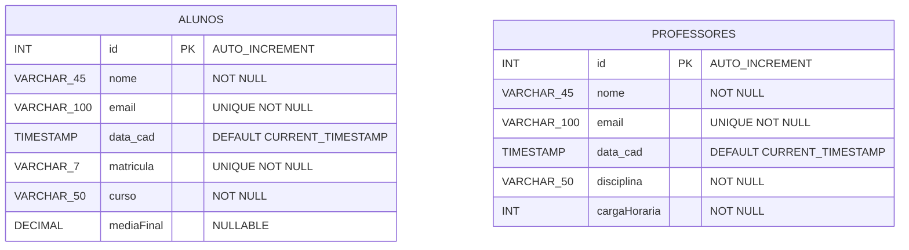

### Restrições do Banco

| Tabela        | Campo          | Tipo           | Restrição                       |
| ------------- | -------------- | -------------- | ------------------------------- |
| `alunos`      | `id`           | `INT`          | `AUTO_INCREMENT`, `PRIMARY KEY` |
| `alunos`      | `nome`         | `VARCHAR(45)`  | `NOT NULL`                      |
| `alunos`      | `email`        | `VARCHAR(100)` | `UNIQUE NOT NULL`               |
| `alunos`      | `data_cad`     | `TIMESTAMP`    | `DEFAULT CURRENT_TIMESTAMP`     |
| `alunos`      | `matricula`    | `VARCHAR(7)`   | `UNIQUE NOT NULL`               |
| `alunos`      | `curso`        | `VARCHAR(50)`  | `NOT NULL`                      |
| `alunos`      | `mediaFinal`   | `DECIMAL(2,2)` | `NULLABLE`                      |
| `professores` | `id`           | `INT`          | `AUTO_INCREMENT`, `PRIMARY KEY` |
| `professores` | `nome`         | `VARCHAR(45)`  | `NOT NULL`                      |
| `professores` | `email`        | `VARCHAR(100)` | `UNIQUE NOT NULL`               |
| `professores` | `data_cad`     | `TIMESTAMP`    | `DEFAULT CURRENT_TIMESTAMP`     |
| `professores` | `disciplina`   | `VARCHAR(50)`  | `NOT NULL`                      |
| `professores` | `cargaHoraria` | `INT`          | `NOT NULL`                      |

---

## 🔄 Ciclo de Vida de uma Requisição

### Criação de Aluno (`POST /alunos`)

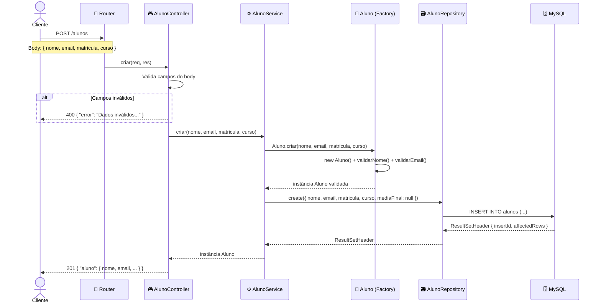

### Atualização de Aluno (`PUT /alunos/:id`)

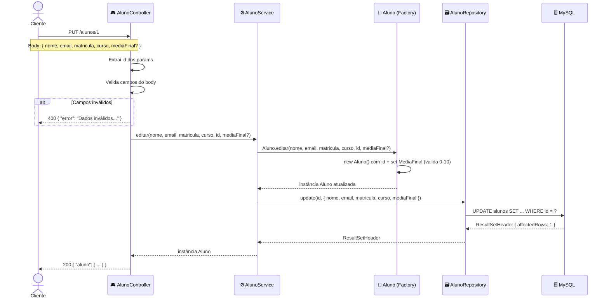

### Fluxo de Deleção (`DELETE /alunos/:id`)

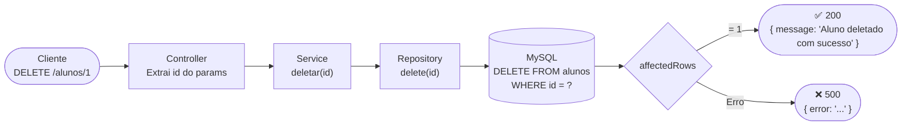

---

## 📡 Endpoints da API

### 👨‍🎓 Alunos — `/alunos`

| Método   | Rota            | Descrição                    | Parâmetros               |
| -------- | --------------- | ---------------------------- | ------------------------ |
| `GET`    | `/alunos`       | Lista todos os alunos        | —                        |
| `GET`    | `/alunos/:id`   | Busca aluno por ID           | `id` (param)             |
| `GET`    | `/alunos/nome`  | Busca alunos por nome (LIKE) | `?nome=string` (query)   |
| `GET`    | `/alunos/email` | Busca aluno por email (LIKE) | `?email=string` (query)  |
| `POST`   | `/alunos`       | Cria um novo aluno           | Body JSON                |
| `PUT`    | `/alunos/:id`   | Atualiza dados de um aluno   | `id` (param) + Body JSON |
| `DELETE` | `/alunos/:id`   | Remove um aluno              | `id` (param)             |

### 👨‍🏫 Professores — `/professores`

| Método   | Rota                 | Descrição                         | Parâmetros               |
| -------- | -------------------- | --------------------------------- | ------------------------ |
| `GET`    | `/professores`       | Lista todos os professores        | —                        |
| `GET`    | `/professores/:id`   | Busca professor por ID            | `id` (param)             |
| `GET`    | `/professores/nome`  | Busca professores por nome (LIKE) | `?nome=string` (query)   |
| `GET`    | `/professores/email` | Busca professor por email (LIKE)  | `?email=string` (query)  |
| `POST`   | `/professores`       | Cria um novo professor            | Body JSON                |
| `PUT`    | `/professores/:id`   | Atualiza dados de um professor    | `id` (param) + Body JSON |
| `DELETE` | `/professores/:id`   | Remove um professor               | `id` (param)             |

### Mapa de Rotas

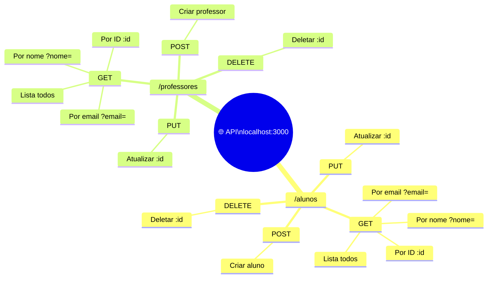

---

## 📦 Formato das Respostas

### Sucesso

```json
// GET /alunos → 200
{
  "alunos": [
    {
      "id": 1,
      "nome": "João Silva",
      "email": "joao@email.com",
      "data_cad": "2024-03-01T10:00:00.000Z",
      "matricula": "2024001",
      "curso": "ADS",
      "mediaFinal": 8.50
    }
  ]
}

// POST /alunos → 201
{
  "aluno": {
    "nome": "João Silva",
    "email": "joao@email.com",
    "matricula": "2024001",
    "curso": "ADS"
  }
}

// GET /professores/1 → 200
{
  "professor": {
    "id": 1,
    "nome": "Maria Souza",
    "email": "maria@escola.com",
    "data_cad": "2024-01-15T08:30:00.000Z",
    "disciplina": "Matemática",
    "cargaHoraria": 40
  }
}

// DELETE /alunos/1 → 200
{
  "message": "Aluno deletado com sucesso"
}
```

### Erros

```json
// 400 - Dados inválidos no body
{ "error": "Dados inválidos para criação de aluno" }

// 400 - Query parameter inválido
{ "error": "Nome deve ser um texto" }

// 404 - Recurso não encontrado
{ "error": "Aluno não encontrado" }

// 500 - Erro interno com detalhes
{
  "error": "Erro ao selecionar alunos",
  "details": "mensagem do erro original"
}
```

### Códigos HTTP

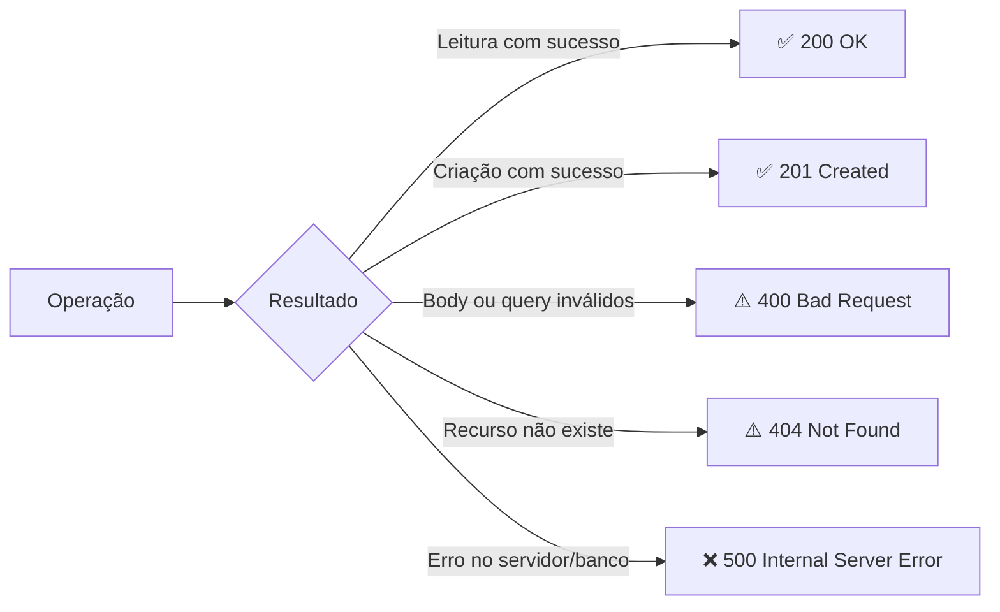

---

## ✅ Validações de Negócio

As validações são aplicadas diretamente nas **classes de domínio**, garantindo integridade dos dados antes de qualquer operação no banco.

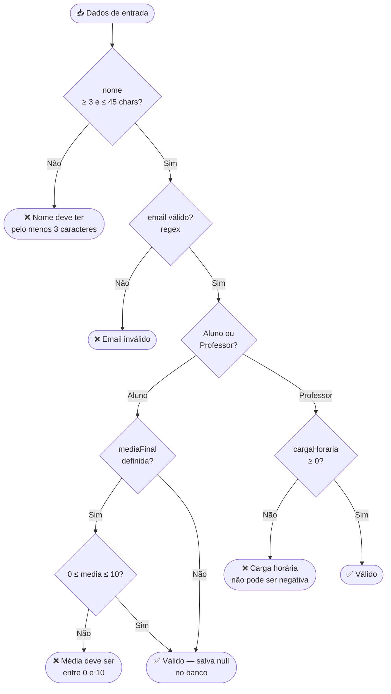

| Entidade    | Campo            | Regra de Validação                                        |
| ----------- | ---------------- | --------------------------------------------------------- |
| `Pessoa`    | `nome`           | Mínimo 3 e máximo 45 caracteres                           |
| `Pessoa`    | `email`          | Formato válido: `usuario@dominio.ext`                     |
| `Aluno`     | `mediaFinal`     | Entre `0` e `10` quando definida; salva `null` se omitida |
| `Aluno`     | `estaAprovado()` | Retorna `true` se `mediaFinal >= 6`                       |
| `Professor` | `cargaHoraria`   | Não pode ser negativa                                     |

---

## 🛠️ Tecnologias

### Dependências de Produção

<div align="center">


</div>

### Dependências de Desenvolvimento

<div align="center">


</div>

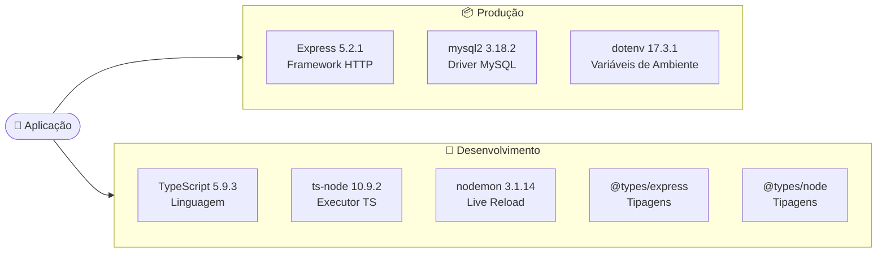

---

## 🔍 Qualidade de Código

O projeto foi analisado e aprovado pelo **SonarQube** sem nenhuma issue crítica ou bloqueante.

<div align="center">


</div>

### Plugin SonarQube (SonarLint)

Este projeto utiliza o **SonarLint** (plugin SonarQube para VS Code) para análise estática em tempo real durante o desenvolvimento. As verificações incluem:

- Detecção de **Code Smells** e más práticas TypeScript
- Identificação de **vulnerabilidades** de segurança (incluindo SQL Injection)
- Verificação de **cobertura de código**
- Análise de **complexidade ciclomática**
- Alertas sobre **duplicação de código**

Para configurar a análise do projeto, crie o arquivo `sonar-project.properties` na raiz:

```properties
sonar.projectKey=school-crud-api
sonar.projectName=School CRUD API
sonar.sources=src
sonar.language=ts
sonar.typescript.tsconfigPath=tsconfig.json
sonar.exclusions=node_modules/**,dist/**
```

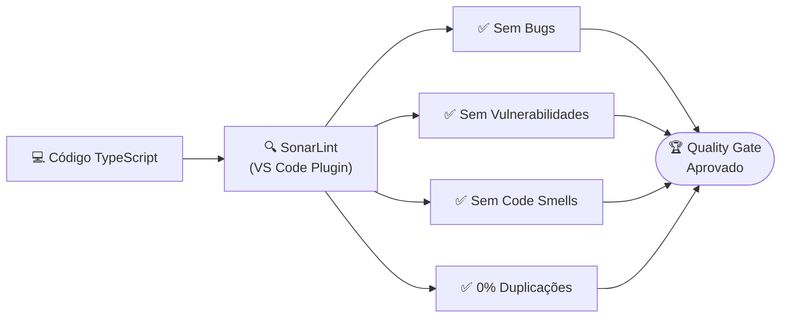

---

## 🧪 Ferramentas de Teste

### Insomnia

<div align="center">


</div>

Recomendado para testes manuais e exploração dos endpoints durante o desenvolvimento.

**Configuração de ambiente no Insomnia:**

```json
{
  "base_url": "http://localhost:3000",
  "aluno_id": "1",
  "professor_id": "1"
}
```

**Exemplo de requisição:**

```
POST {{ base_url }}/alunos
Content-Type: application/json

{
  "nome": "João Silva",
  "email": "joao@email.com",
  "matricula": "2024001",
  "curso": "ADS"
}
```

### Postman

<div align="center">


</div>

Compatível com o Postman para testes, documentação automática e scripts de automação.

**Collection sugerida:** Crie um arquivo `School CRUD API.postman_collection.json` com as seguintes pastas:

- `Alunos` → GET, POST, PUT, DELETE
- `Professores` → GET, POST, PUT, DELETE

**Exemplo de script de teste no Postman (aba Tests):**

```javascript
pm.test("Status 201 Created", () => {
  pm.response.to.have.status(201);
});

pm.test("Resposta contém aluno", () => {
  const json = pm.response.json();
  pm.expect(json).to.have.property("aluno");
  pm.expect(json.aluno).to.have.property("nome");
});
```

### Fluxo de Testes

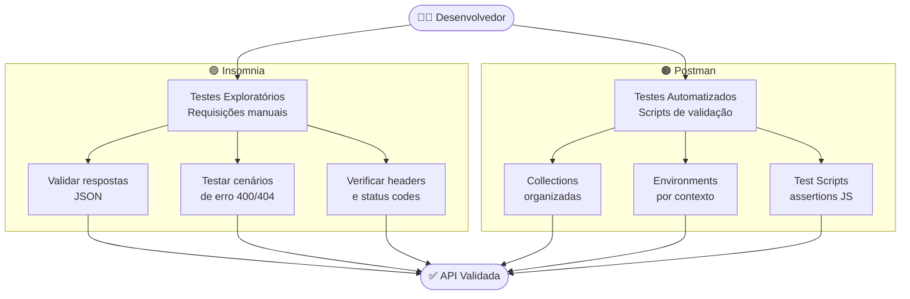

---

## 🚀 Como Executar

### Pré-requisitos

- Node.js (LTS)
- MySQL 8+
- npm

### Instalação

```bash
# 1. Clone o repositório
git clone https://github.com/seu-usuario/school-crud-api.git
cd school-crud-api

# 2. Instale as dependências
npm install

# 3. Configure as variáveis de ambiente
cp .env.example .env
# Edite o arquivo .env com suas credenciais do MySQL

# 4. Execute o schema no banco de dados
mysql -u root -p < docs/banco.sql

# 5. Inicie o servidor em modo desenvolvimento
npm run dev
```

### Variáveis de Ambiente

```env
DB_HOST=localhost
DB_PORT=3306
DB_USER=root
DB_PASSWORD=sua_senha
DB_NAME=escola_att
PORT=3000
```

### Script de Desenvolvimento

O projeto utiliza `nodemon` com `ts-node` para hot-reload automático durante o desenvolvimento:

```json
"dev": "nodemon --watch *.ts ts-node src/server.ts"
```

---

## 📐 Padrões de Projeto

```mermaid
mindmap
  root(("🏛️ Padrões\nAplicados"))
    Factory Method
      Aluno.criar()
      Aluno.editar()
      Aluno.deletar()
      Professor.criar()
      Professor.editar()
      Professor.deletar()
    Repository Pattern
      AlunoRepository
      ProfessorRepository
      Queries parametrizadas
      Isolamento do banco
    Layered Architecture
      Controller
      Service
      Repository
      Model
    OOP
      Herança
        Pessoa → Aluno
        Pessoa → Professor
      Abstração
        Pessoa abstract
        IPessoa interface
      Encapsulamento
        Getters e Setters
        Validações privadas
```

| Padrão                   | Onde é Aplicado                                                                    | Benefício                                                                                  |
| ------------------------ | ---------------------------------------------------------------------------------- | ------------------------------------------------------------------------------------------ |
| **Factory Method**       | `Aluno.criar()`, `Aluno.editar()`, `Aluno.deletar()` e equivalentes em `Professor` | Controla a criação de objetos, centraliza validações e evita instâncias inválidas          |
| **Repository Pattern**   | `AlunoRepository`, `ProfessorRepository`                                           | Isola o acesso ao banco, facilita troca de ORM/driver e torna o Service agnóstico ao banco |
| **Layered Architecture** | Toda a estrutura do projeto                                                        | Separação clara de responsabilidades, testabilidade e manutenibilidade                     |
| **Herança e Abstração**  | `Pessoa (abstract)` → `Aluno`, `Professor`                                         | Reutilização de código, validações compartilhadas, contrato via `IPessoa`                  |

---

## 📄 Licença

Distribuído sob a licença **ISC**. Consulte o `package.json` para mais detalhes.

---

<div align="center">
  <sub>Desenvolvido com TypeScript, Express e MySQL2</sub>
</div>
